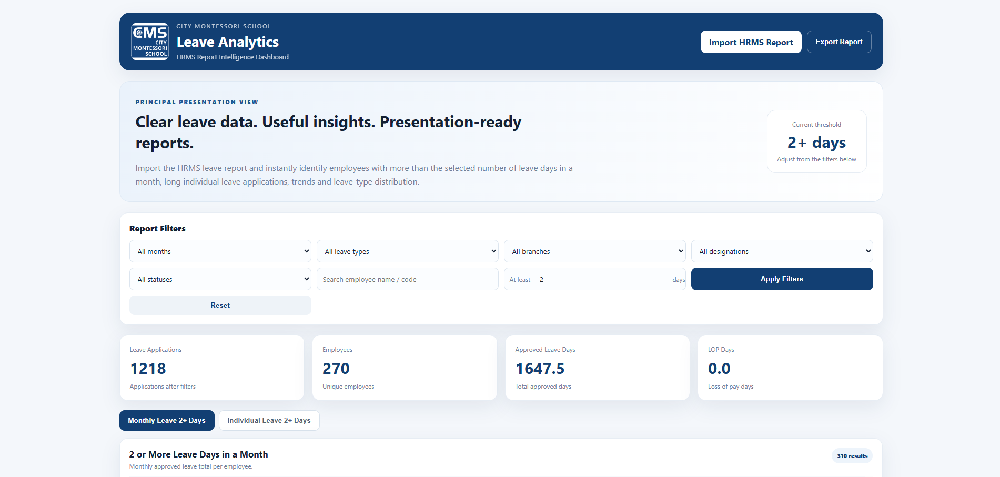

# CMS Leave Analytics

A Flask-based web application for analyzing employee leave records
and generating useful reports and visualizations.

## Features

- Upload leave data
- Employee-wise leave analysis
- Monthly leave analysis
- Leave record filtering
- Leave trend visualization
- Dashboard with key statistics
- Excel-based data processing
- Responsive web interface

## Tech Stack

- Python
- Flask
- Pandas
- OpenPyXL
- HTML
- CSS
- JavaScript

## How to Run

## How to Run

### 1. Clone the repository

```bash
git clone https://github.com/thecodinglax/cms-leave-analytics.git
```

### 2. Install dependencies

```bash
pip install -r requirements.txt
```

### 3. Run the application

```bash
python app.py
```

### 4. Open in browser

```text
http://127.0.0.1:5000
```

## Screenshots

### Dashboard


